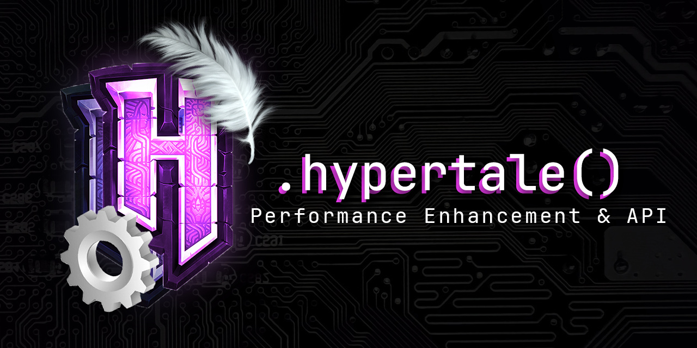

# Hypertale

Optimization mod and API extender for Hytale

Note: This is early development, bugs might happen.

An example mod is available at: https://github.com/Fox2Code/HypertaleExampleMod

## About

This mod improves performance and reduces memory pressure on the Hytale server!

Memory pressure is how much memory is allocated per second.
When high, this makes the java garbage collector slow the server down a lot!

Spark was used extensively a lot to help with performance profiling.

Hypertale should be compatible with existing performance mods for Hytale!

## Building

Hypertale will try to locate Hytale client/launcher to allow building it without issues, 
with a fallback to `./HypertaleServer.jar` if you do not have Hytale installed on the building machine!

Running `./gradlew build` should then provide a file in `launcher/build/libs` for you to grab!

## Mod support

Hypertale should not cause any compatibility issues with any mod!

Hypertale currently has custom support code for the following mods:
- Mod List Mods -> add icon (Icon by ColdLavenderSun aka. Fluttershy)
- ModSync -> Support bootstrap ([ModTale](https://modtale.net/mod/modsync-8329f904-978d-4138-bc37-0d1ef7749dc4) | [CurseForge](https://www.curseforge.com/hytale/bootstrap/modsync-bootstrap))

## New APIs and changes:

Add new fields to `manifest.json` hypertale will read:
- `HypertalePreLoad` if `true` it will load your mod in the same ClassLoader as the HytaleServer.jar
- `HypertaleJavaAgent` class in your mod to add as a java agent.
- `HypertaleMixinConfig` mixins configuration to apply to the server.

Add new APIs with the `.hypertale()` extension for:
- `com.hypixel.hytale.server.core.entity.entities.Player`
- `com.hypixel.hytale.server.core.plugin.PluginBase`
- `com.hypixel.hytale.server.core.universe.PlayerRef`
- `com.hypixel.hytale.server.core.universe.world.World`